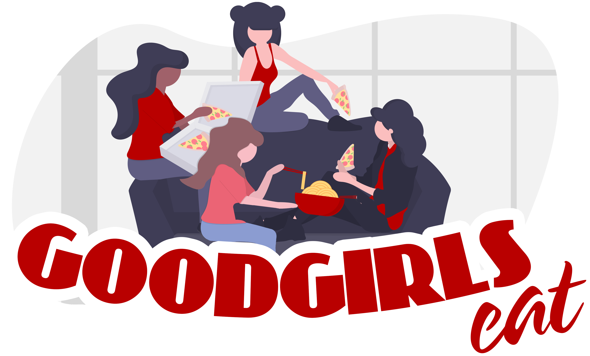

##### *A quick & easy recipe app created by Bibu, Corinna, Jia, & Osase, AKA The Good Girls!*
****

# About Good Girls Eat
This mobile-specific application will allow users to find new, delicious recipes with help from the Spoontacluar recipe API. Users will be able to search for new recipes, save their favourite dishes,  email recipes to their friends, and even leave notes for themselves! We also share  bite-sized information about ourselves and our favourite meals! Make sure you say hello to us through our contact page!
 
# Installation  
To run this application, you'll need Git and Node.js (includes npm) already installed on your computer. In your terminal:

**1. Clone this repository from GitHub:**
\
*$ git clone https://github.com/TECHCareers-by-Manpower/milestone-2-react-redux-project-jia_osase_bibhu_corinna.git*

**2. Navigate to the repository:**
\
*$ cd milestone-2-react-redux-project-jia_osase_bibhu_corinna*

**3. Install npm:**
\
*$ npm install*

**4. Run our app!**
\
*$ npm start*

**5. In your browser's Developer Tools, change the view toa  mobile-device of your choice & enjoy!**

# Features & Functionality (By Page)
**Home**  
This page serves as an introductory welcome page.  User is introduced to 3 figure containers containing different images, descriptions, and unified styling. A sticky footer houses 5 FontAwesome icons that link internally to the remaining pages and serves as a navigation bar.

**Good Girls Favorite Eats**  
Here, users will read more information about each of the Good Girls and 2 of their favourite dishes. These are static images and text and do not link to recipes. Placeholder text is used.

**Search**  
A search input field allows users to enter a keyword that will pull from an assortment of Good Girls selected recipes preloaded from the Spoonacular Recipe & Food API. Any word that appears in the title of the food is searchable. User can hit enter or click search button to proceed. Results will populate below the search form. User has ability to favorite/unfavorite any returned recipe. This is signalled by 2 FontAwesome icons that toggle on click. Favorited recipes will be stored in the "Your Favorite Eats" page described next.

**Your Favorite Eats**  
All recipes that were favorited from the search feature are housed here. Saved recipes will remain visible and saved until the page is refreshed. All recipes can also be unfavorited from this page as well by clicking on the FontAwesome icon. This will remove the recipe from the list and keep the remaining saved recipes.

**Contact**  
This page includes a functioning email form allowing users to input data in order to contact us. Required data fields are name, email, subject, message, and a submit button. The form reloads to a blank form upon submission.

# Mockup
Here is our original mockup to serve as a visual guide while creating this application:

# Proposed Features

 - Featured Recipe and gallery on main page that makes recipe suggestions according to the user's local time of day
 - Search recipes with tags (keto, by ingredients, etc.)
 - User sign in to access additional features (such as commenting, voting, and emailing recipes) 
 - Access individual recipe cards once a recipe is clicked (as seen in the mockup)

**[| Please click here to view our Trello Board |](https://trello.com/invite/b/h0gFk4MN/06c782d5896e584347c81c1ecbb3b0cf/our-recipe-app)**
